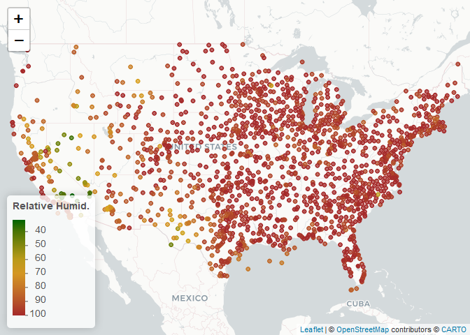

README
================
Stephanie Lee
2022-10-23

# 1. Read in data

``` r
if (!file.exists("met_all.gz"))
  download.file(
    url = "https://raw.githubusercontent.com/USCbiostats/data-science-data/master/02_met/met_all.gz",
    destfile = "met_all.gz",
    method   = "libcurl",
    timeout  = 60
    )
met <- data.table::fread("../Lab 3/met_all.gz")
```

# 2. Prep Data

Remove temps less than -17 and change elev 9999 to missing value.

``` r
met <- met[temp > -17][elev == 9999.0, elev := NA]
summary(met)
```

    ##      USAFID            WBAN            year          month        day    
    ##  Min.   :690150   Min.   :  116   Min.   :2019   Min.   :8   Min.   : 1  
    ##  1st Qu.:720927   1st Qu.: 3705   1st Qu.:2019   1st Qu.:8   1st Qu.: 8  
    ##  Median :722720   Median :13841   Median :2019   Median :8   Median :16  
    ##  Mean   :723095   Mean   :29496   Mean   :2019   Mean   :8   Mean   :16  
    ##  3rd Qu.:725090   3rd Qu.:54768   3rd Qu.:2019   3rd Qu.:8   3rd Qu.:24  
    ##  Max.   :726813   Max.   :94998   Max.   :2019   Max.   :8   Max.   :31  
    ##                                                                          
    ##       hour            min             lat             lon         
    ##  Min.   : 0.00   Min.   : 0.00   Min.   :24.55   Min.   :-124.29  
    ##  1st Qu.: 6.00   1st Qu.:20.00   1st Qu.:33.98   1st Qu.: -98.02  
    ##  Median :11.00   Median :48.00   Median :38.37   Median : -91.74  
    ##  Mean   :11.46   Mean   :39.23   Mean   :37.97   Mean   : -92.14  
    ##  3rd Qu.:17.00   3rd Qu.:55.00   3rd Qu.:41.96   3rd Qu.: -82.99  
    ##  Max.   :23.00   Max.   :59.00   Max.   :48.94   Max.   : -68.31  
    ##                                                                   
    ##       elev           wind.dir      wind.dir.qc        wind.type.code    
    ##  Min.   : -13.0   Min.   :  3      Length:2317204     Length:2317204    
    ##  1st Qu.: 101.0   1st Qu.:120      Class :character   Class :character  
    ##  Median : 252.0   Median :180      Mode  :character   Mode  :character  
    ##  Mean   : 414.3   Mean   :185                                           
    ##  3rd Qu.: 400.0   3rd Qu.:260                                           
    ##  Max.   :4113.0   Max.   :360                                           
    ##  NA's   :182      NA's   :732170                                        
    ##     wind.sp       wind.sp.qc          ceiling.ht    ceiling.ht.qc  
    ##  Min.   : 0.00   Length:2317204     Min.   :    0   Min.   :1.000  
    ##  1st Qu.: 0.00   Class :character   1st Qu.: 3048   1st Qu.:5.000  
    ##  Median : 2.10   Mode  :character   Median :22000   Median :5.000  
    ##  Mean   : 2.46                      Mean   :16171   Mean   :4.945  
    ##  3rd Qu.: 3.60                      3rd Qu.:22000   3rd Qu.:5.000  
    ##  Max.   :36.00                      Max.   :22000   Max.   :9.000  
    ##  NA's   :31743                      NA's   :73437                  
    ##  ceiling.ht.method    sky.cond            vis.dist      vis.dist.qc       
    ##  Length:2317204     Length:2317204     Min.   :     0   Length:2317204    
    ##  Class :character   Class :character   1st Qu.: 16093   Class :character  
    ##  Mode  :character   Mode  :character   Median : 16093   Mode  :character  
    ##                                        Mean   : 14924                     
    ##                                        3rd Qu.: 16093                     
    ##                                        Max.   :160000                     
    ##                                        NA's   :33666                      
    ##    vis.var           vis.var.qc             temp         temp.qc         
    ##  Length:2317204     Length:2317204     Min.   :-3.00   Length:2317204    
    ##  Class :character   Class :character   1st Qu.:19.60   Class :character  
    ##  Mode  :character   Mode  :character   Median :23.50   Mode  :character  
    ##                                        Mean   :23.59                     
    ##                                        3rd Qu.:27.80                     
    ##                                        Max.   :56.00                     
    ##                                                                          
    ##    dew.point      dew.point.qc         atm.press        atm.press.qc  
    ##  Min.   :-37.20   Length:2317204     Min.   : 960.5    Min.   :1.000  
    ##  1st Qu.: 13.80   Class :character   1st Qu.:1011.8    1st Qu.:5.000  
    ##  Median : 18.10   Mode  :character   Median :1014.1    Median :9.000  
    ##  Mean   : 17.02                      Mean   :1014.2    Mean   :7.696  
    ##  3rd Qu.: 21.70                      3rd Qu.:1016.4    3rd Qu.:9.000  
    ##  Max.   : 36.00                      Max.   :1059.9    Max.   :9.000  
    ##  NA's   :6287                        NA's   :1606783                  
    ##        rh         
    ##  Min.   :  0.833  
    ##  1st Qu.: 55.790  
    ##  Median : 76.554  
    ##  Mean   : 71.641  
    ##  3rd Qu.: 90.629  
    ##  Max.   :100.000  
    ##  NA's   :6287

Generate a date variable:

``` r
met <- met[ , ymd := as.Date(paste(year, month, day, sep="-"))]
```

``` r
met[, table(week(ymd))]
```

    ## 
    ##     31     32     33     34     35 
    ## 371544 520440 529571 526312 369337

Keep observations of only first week of the month.

``` r
met_week1 <- met[week(ymd) == 31]
```

Compute variable means by station:

``` r
met_avg <- met_week1[, .(
  temp      = max(temp,na.rm=T),
  rh        = max(rh,na.rm=T), 
  wind.sp   = max(wind.sp,na.rm=T), 
  vis.dist  = max(vis.dist,na.rm=T), 
  dew.point = max(dew.point,na.rm=T), 
  lat       = max(lat,na.rm=T), 
  lon       = max(lon,na.rm=T), 
  elev      = max(elev,na.rm=T)
), by = "USAFID"]
```

    ## Warning in gmax(wind.sp, na.rm = TRUE): No non-missing values found in at least
    ## one group. Returning '-Inf' for such groups to be consistent with base

    ## Warning in gmax(vis.dist, na.rm = TRUE): No non-missing values found in at least
    ## one group. Coercing to numeric type and returning 'Inf' for such groups to be
    ## consistent with base

``` r
met_avg
```

    ##       USAFID temp        rh wind.sp vis.dist dew.point    lat      lon elev
    ##    1: 690150 43.3  35.97508     9.3    16093      10.6 34.300 -116.162  696
    ##    2: 720110 40.0  94.16652     6.2    16093      23.0 30.784  -98.662  336
    ##    3: 720113 32.1  86.25461     6.2    16093      20.6 42.543  -83.178  222
    ##    4: 720120 31.0 100.00000     8.2    30578      25.0 32.224  -80.697    6
    ##    5: 720137 31.3  98.76564     5.1    16093      21.1 41.425  -88.419  178
    ##   ---                                                                      
    ## 1571: 726777 33.9  96.25454    14.4    16093      18.9 46.358 -104.250  906
    ## 1572: 726797 33.3  93.19943    18.0    16093      14.4 45.788 -111.153 1363
    ## 1573: 726798 33.9  83.17287    17.0    16093      13.9 45.698 -110.440 1408
    ## 1574: 726810 37.2  60.34429     7.2    16093      13.3 43.567 -116.233  874
    ## 1575: 726813 36.7  75.06851     7.7    16093      16.1 43.650 -116.633  741

``` r
met_avg[, region := fifelse(lon >= -98 & lat > 39.71, "NE",
                    fifelse(lon < -98 & lat > 39.71, "NW",
                    fifelse(lon < -98 & lat <= 39.71, "SW", "SE")))]
table(met_avg$region)
```

    ## 
    ##  NE  NW  SE  SW 
    ## 484 146 650 295

``` r
met_avg[, elev_cat := fifelse(elev > 252, "high", "low")]
```

# 3. Use geom_violin to examine the wind speed and dew point temp by region

``` r
met_avg[!is.na(region)] %>%
  ggplot() +
  geom_violin(mapping = aes(y = dew.point, x = 1, color=region, fill = region)) +
  facet_wrap(~ region, nrow=1)
```

<!-- -->

``` r
met_avg[!is.na(region) & !is.na(wind.sp)] %>%
  ggplot() +
  geom_violin(mapping = aes(x=1, y=wind.sp, color=region, fill=region)) +
  facet_wrap(~ region, nrow = 2)
```

    ## Warning: Removed 13 rows containing non-finite values (stat_ydensity).

<!-- --> \#
4. Use geom_point with geom_smooth to examine the association between
dew point temp and wind speed

Color points by region and make sure to deal w NA category. Fit a linear
regression line by region and describe graph observations.

``` r
met_avg[!is.na(region) & !is.na(wind.sp)] %>% 
  ggplot(mapping = aes(x = wind.sp, y = dew.point, color=region)) + 
  geom_point(mapping = aes(color = region)) + 
  geom_smooth(method = lm, mapping = aes(linetype = region)) +
  facet_wrap(~ region, nrow = 2)
```

    ## `geom_smooth()` using formula 'y ~ x'

    ## Warning: Removed 13 rows containing non-finite values (stat_smooth).

<!-- -->
\# 5. Create barplots of weather stations by elevation category colored
by region

``` r
met_avg[!is.na(elev)] %>%
  ggplot()+
  geom_bar(mapping = aes(x = elev_cat, fill=region))
```

<!-- -->

# 6. Use stat_summary to examine mean dew point and wind speed by region with std dev error bars

``` r
met_avg[!is.na(dew.point)] %>%
  ggplot(mapping = aes(x = region, y = dew.point)) + 
  stat_summary(fun.data=mean_sdl, geom = 'errorbar') +
  stat_summary(fun.data = mean_sdl, geom = "pointrange")
```

<!-- --> \# 7.
Generate a map of weather stations and show trend in relative humidity
of top 10

``` r
library(leaflet)
rh.pal <- colorNumeric(c('darkgreen','goldenrod','brown'), domain=met_avg$rh)
rh.pal
```

    ## function (x) 
    ## {
    ##     if (length(x) == 0 || all(is.na(x))) {
    ##         return(pf(x))
    ##     }
    ##     if (is.null(rng)) 
    ##         rng <- range(x, na.rm = TRUE)
    ##     rescaled <- scales::rescale(x, from = rng)
    ##     if (any(rescaled < 0 | rescaled > 1, na.rm = TRUE)) 
    ##         warning("Some values were outside the color scale and will be treated as NA")
    ##     if (reverse) {
    ##         rescaled <- 1 - rescaled
    ##     }
    ##     pf(rescaled)
    ## }
    ## <bytecode: 0x0000000026f0a040>
    ## <environment: 0x0000000026f0c6d0>
    ## attr(,"colorType")
    ## [1] "numeric"
    ## attr(,"colorArgs")
    ## attr(,"colorArgs")$na.color
    ## [1] "#808080"

``` r
top10rh <- met_avg[ rank(-rh) <= 10]
```

``` r
rhmap <- leaflet(met_avg) %>% 
  # The looks of the Map
  addProviderTiles('CartoDB.Positron') %>% 
  # Some circles
  addCircles(
    lat = ~lat, lng=~lon,
                                                  # HERE IS OUR PAL!
    label = ~paste0(rh), color = ~ rh.pal(rh),
    opacity = 1, fillOpacity = 1, radius = 500
    ) %>%
  # And a pretty legend
  addLegend('bottomleft', pal=rh.pal, values=met_avg$rh,
          title='Relative Humid.', opacity=1)
rhmap
```

<!-- -->
